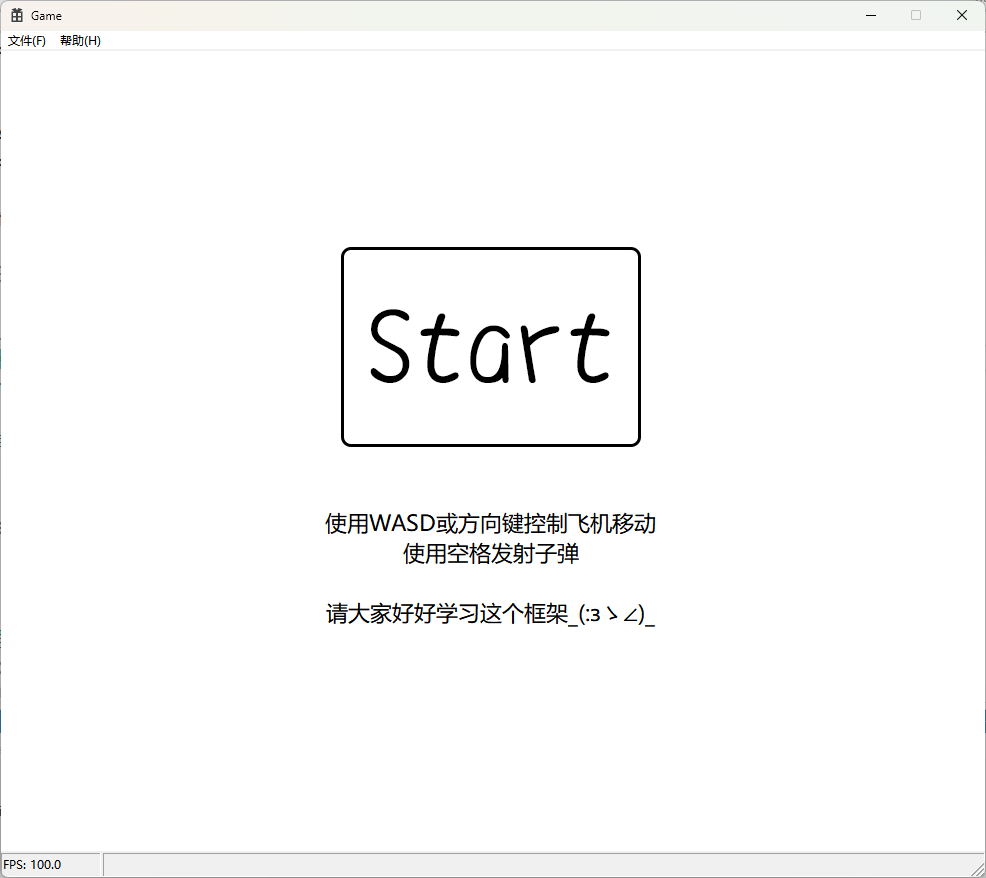

# Game

基于Win32API开发的简单游戏框架，面向《程序设计基础》课程的大作业项目。

除了**框架代码**用了C++标准库外，其他代码基本都是C风格的，仍然建议大家学习一下`std::vector`的[用法](https://en.cppreference.com/w/cpp/container/vector.html)。

> 可以的话再学习一下`std::set`的[用法](https://en.cppreference.com/w/cpp/container/set.html)。

游戏框架设计请点击[这里](docs/design.md)。

游戏实验指导书请点击[这里](docs/instruct.md)。

## 界面展示：

开始界面

游戏界面

