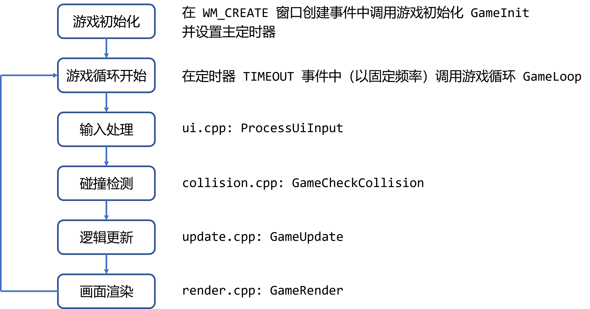

# 游戏框架设计

让我们从时序视角和资源管理的视角来看待这个框架。

## 时序

游戏的时序很简单，就是在游戏一开始进行一些初始化操作（如果需要的话），并且设置主定时器。然后主定时器以固定频率调用游戏循环函数，每一次游戏循环分别进行输入处理、碰撞检测、逻辑更新和画面渲染。

- 输入处理是UI模块负责，输入模块会缓存键盘、鼠标等玩家输入，UI读取这些输入并判断是否需要进行响应
- 碰撞检测是碰撞检测模块负责，碰撞检测会处理不同场景下不同类型的物体碰撞，并根据碰撞结果作出响应
- 逻辑更新模块会更新所有游戏对象的逻辑，例如移动等
- 画面渲染模块会绘制所有的内容，包括游戏对象和UI，并且先绘制游戏对象再绘制UI

## 资源

游戏的资源管理很简单，以**场景**为最大的单位，例如欢迎界面是一个场景，游戏界面是另一个场景。

每一个场景都包含游戏对象和UI，在场景切换的时候要妥善处理好旧游戏对象的销毁与新游戏对象的创建、旧UI的销毁与新UI的创建。

## 两者之间的联系

时序逻辑中的每一个函数调用都是按照资源的层级逐层向下调用的，例如

- 在场景初始化的时候，场景管理会先调用游戏对象管理和UI的初始化函数，游戏对象管理的初始化函数会调用玩家、敌人和子弹的初始化函数，UI的初始化函数会调用按钮的初始化函数
- 在场景切换的时候，场景管理会先调用游戏对象管理和UI的销毁函数，切换场景，然后再调用游戏管理和UI的创建函数；游戏对象管理的销毁函数会调用玩家、敌人和子弹的销毁函数，创建函数同理；UI同理
- 在逻辑更新的时候，会调用游戏对象管理器的逻辑更新函数，游戏对象管理器的逻辑更新函数再调用玩家、敌人和子弹等游戏对象的逻辑更新函数
- 在画面渲染的时候，会调用游戏对象管理器的画面渲染函数，游戏对象管理器的画面渲染函数再调用玩家、敌人和子弹等游戏对象的画面渲染函数，UI同理

理解清晰这个点！
